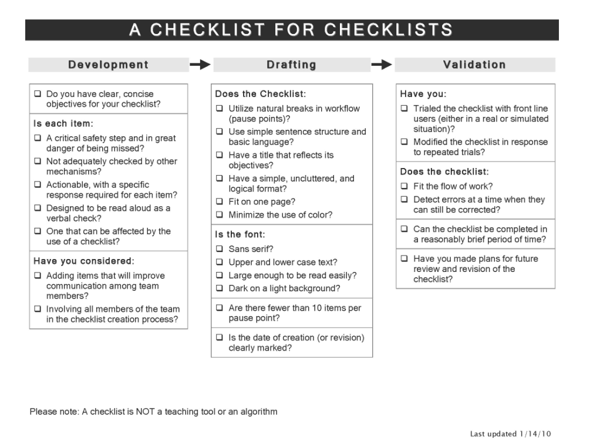

## Developing this skill will help you:

- Get more done
- Work more efficiently
- Reduce throughput times
- Reduce the number of errors
- Standardize & automate processes

## The concept of processes

Processes are the backbone of any organization.
They enable scaling beyond the limits of individual humans.

Unfortunately, not every process is equally good or still viable.

As a framework to open the black box of processes, IPOO is a good starting point.

import IPOO from "../../img/svg/IPOO.svg"

<IPOO />

**Input:**
Everything that it takes to execute a process, including resources, personnel, & infrastructure.

**Process:**
A sequence of steps to transform something into something different. E.g. cutting, sanding, & painting of car parts.

**Output:**
The immediate result of a process. E.g. a product increment, delivery of a service, or a batch of donuts.

**Outcome:**
A consequence of the output when viewed from a business perspective. E.g. Revenues, costs, shares, or likes.

## Your learning journey

We'll use the IPOO framework from management accounting as a guide to approaching processes.
Also, we'll enrich this framework with best practices from lean management, like Kanban, Value Stream Mapping, Waste Elimination, & Kaizen.

First, we'll look at the context of processes: Outcome → Output → Input.

Then we'll open that black box and look inside.

This way you'll design process to a specific purpose.
Such a purpose helps you assess potentials for redesign of existing processes.

#### Do each exercise for three processes.

You can choose three for all, or pick three new processes every time.

## Understand context

Processes exist in context.
That is their benchmark for performance and a source of complications.

### Exercise #1: Discover outcomes

---

In business, generating output usually effects multiple relevant outcomes.
Outcomes are the ripple effects of throwing a unit of output into the business pond.

Examples for units of output are pieces, product increments, metric tons, hours, and lines of codes.

**Example:** The sale of a single iPhone (one piece) results in:

- Revenues of \$X from the sale
- Reduction of \$Y in inventory
- A delighted customer
- Recurring revenues of \$Z through subsequent iTunes and App store purchases
- A new source of ~ 500,000 data points

What is one unit of output from your process?
And what ripple effects does one unit have?

Be as specific as possible in estimating these figures.

**Bonus:** Brainstorm ways you could automatically monitor these outcomes.

<DoneButton skill={props.frontmatter.skill} done={true} exNum={1} />

### Exercise #2: Define done

---

Standardization sometimes has a bad reputation.
While bureaucracy can take things to far, standardization enables increases in efficiency and automation.

Kanban uses Definitions of Done (DoD) to ensure constant quality of outputs.

Importantly, a good DoD is a set of characteristics of the output, not a list of steps that went into producing the output.
Focussing on characteristics creates different options to achieving them.

Here's an example for a piece of silver jewelry:

- Has a silver content of 92,5%
- Has a fineness mark stamped on
- Is polished on every surface
- Is packaged in a velvet bag
- Is priced with a 240% margin

Which characteristics mark the output of your processes as done?

**Sidenote:** Variations in output are the killer of efficiency.
Do your utmost to eliminate variations or create separate processes for different outputs.
Product increments and resolved support tickets are completely different outputs and deserve different processes.

<DoneButton skill={props.frontmatter.skill} done={true} exNum={2} />

### Exercise #3: Make a checklist

---

There are specific actions or controls that guarantee the quality set by your DoD.

Checklists are a great tool to structure and summarize the critical elements of a process.

To set up a basic checklist, reflect on these two questions:

- What needs to be done to achieve the characteristics for your DoD?
- And what determines if an action is done right?

**Bonus:**
Improve your checklist with the checklist for checklists.

Credits to [http://atulgawande.com/book/the-checklist-manifesto/](http://atulgawande.com/book/the-checklist-manifesto/)

<DoneButton skill={props.frontmatter.skill} done={true} exNum={3} />

### Exercise #4: Start finishing

---

Pushing work into processes creates graveyards of unfinished work.

Pull processes become smooth as they require a steady flow.
Start pulling work through your processes from the end.

Kanban uses WIP-Limits to achieve this:

- A process may only have the amount of work in progress as specified by that limit.

- Start by limiting the Work-In-Progress to 1.
  Only start a new piece of work, when the current one is finished as per your DoD.

- We recommend to always start with a WIP-Limit of 1.
  Once all the kinks in the process are ironed out you can increase the WIP-Limit stepwise.

Now take a look at your work and finish the one thing thats closest to done.

<DoneButton skill={props.frontmatter.skill} done={true} exNum={4} />

### Exercise #5: Value inputs

---

Getting more done is easy, if you have unlimited resources.
Getting more done becomes interesting, if you're resource constrained.

To improve efficiency you need a benchmark of what you put into a process to produce one unit of output.

E.g. the process of a retrospective takes

- all 5 crewmembers
- discussing for 2 hours
- to produce 1 decision about the next improvement.

Guesstimating the employment costs of 1 hour / person to €80, each decision to improve costs 400€.

Looking at quantity, how can you standardize the units of input?

How much of each input is currently needed to produce an output?

<DoneButton skill={props.frontmatter.skill} done={true} exNum={5} />

### Exercise #6: Choose ratios

---

An easy definition for efficiency is the relation between input and output.

This yields two options to increase efficiency:

- increase the units of output per unit of input
- decrease the units of input per unit of output

Both sound similar, yet guide you to completely different solutions.

Another perspective on efficiency is the measurement of throughput time.
Shortening the time it takes to transform inputs to outputs increases efficiency.

There is truth to the saying: “What gets measured gets done.”
What will you measure?

<DoneButton skill={props.frontmatter.skill} done={true} exNum={6} />

## Open black boxes

Having danced around the processes themselves, let's now open those black boxes.
Our goal for inspecting processes is to create smooth flows of throughput.

### Exercise #7: Make toast

---

A process is usually a linear sequence of steps.

The quickest way to visualize a process is to sketch each step as a node.
Then link the nodes with arrows to show direction.

**Pro tips:**

- Use one post-it per step (node).
- Make a coarse sketch, don't sweat the details.
- Add small infos in block letters.

Make sketches of nodes and arrows for your processes.

<Video
  videoSrcURL="https://embed.ted.com/talks/tom_wujec_got_a_wicked_problem_first_tell_me_how_you_make_toast"
  videoTitle="Tom Wujec"
/>

<DoneButton skill={props.frontmatter.skill} done={true} exNum={7} />

### Exercise #8: Via negativa

---

For each process, find something - ideally a complete step - that you can remove.

Here are the 8 wastes of lean management as an inspiration:

- Faster-than-necessary pace
- Waiting
- Conveyance
- Extra-processing
- Excess stock
- Unnecessary motion
- Correction of mistakes

Make sure that quality, according to your DoD, does not decrease.

<DoneButton skill={props.frontmatter.skill} done={true} exNum={8} />

### Exercise #9: Pay debt

---

With the passing of time, processes accumulate old technologies, bureaucratic weight, and variations.
This is called organizational debt.

Often organizational debt is accrued because the daily grind demands continuous performance.
Every so often, we need to pause and invest in paying this debt.
Make an inventory of the organizational debt you've accrued in your processes.
Here are some examples to look at:

- Rules
- Standards
- Technologies
- Interfaces

**Bonus:** Guesstimate the costs you incur due to each debt.

<DoneButton skill={props.frontmatter.skill} done={true} exNum={9} />

### Exercise #10: Reduce breaks

---

Breaks in processes lead to waste: transportation, movement, waiting.

Breaks are changes in

- Technology
- Responsibility
- Location

Make new sketches of your processes as nodes and arrows.
Where do you see breaks?
And how might you eliminate these breaks?

E.g. a paper application that is manually entered into an applicant pool.

<DoneButton skill={props.frontmatter.skill} done={true} exNum={10} />

### Exercise #11: Monitor inventories

---

Make new sketches of your processes as nodes and arrows.
Then locate inventories along that process as little triangles with the count of units currently waiting in them.

- Which inventories can you eliminate or reduce?
- How could you cut the waiting time in an inventory?

<DoneButton skill={props.frontmatter.skill} done={true} exNum={11} />

### Exercise #12: Prevent disruptions

---

Flow is king.

But the daily grind has mischievous ways of throwing blunders into peaceful flows of work.

Make a list of the last 10 issues that interrupted or stopped each process.

Look for patterns in:

- people
- events
- interfacing processes

How might you automate these disruptions away?

<DoneButton skill={props.frontmatter.skill} done={true} exNum={12} />

## More resources

[→ Eric Brechner: Agile Project Management with Kanban](https://www.amazon.de/Agile-Project-Management-Kanban-Practices/dp/0735698953/)
