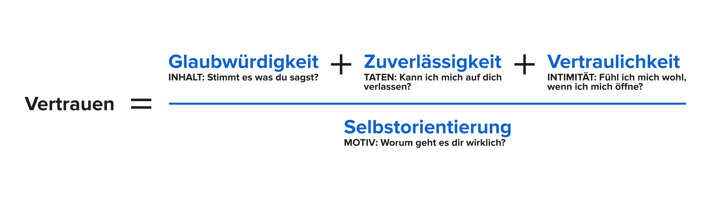

## Info

Vertraulichkeit entsteht, wenn wir uns als Menschen begegnen.
Das beinhaltet ein gewisses Interesse am Gegenüber und die Bereitschaft etwas von sich persönlich zu teilen.

___

## Übung

Wir nehmen unsere Mitmenschen häufig nur äußerlich wahr
Nehmt euch kurz 3 Minuten Zeit, das für euch privat zu durchdenken:

Was für faszinierende Geheimnisse könnten eure Teammitglieder bisher vor euch verbergen?

Nehmt nach den 3 Minuten Stift und Papier.  
Ihr habt nun 5 Minuten, um etwas von euch zu zeichenen auf das ihr besonders stolz seid.
Natürlich sollte das etwas sein, das keiner im Team von euch vermuten würde.
Faltet euer Papier ein paar mal, wenn ihr fertig seid und legt die gesammelten Skizzen zu einem Haufen zusammen. Diesen Haufen mischt ihr gut durch.
Nun geht die Übung reihum:
* Zieht eine Skizze
* Zeigt die Skizze allen, Wenn es nicht eure eigene ist.
* Schlussfolgert nun laut wessen Geheimnis ihr dort offenbart seht und warum. Das sollte für den ein oder anderen Schmunzler sorgen ;)
* Gerne dürfen richtig Erratene noch kleine Details oder Kontextinformationen zu den Skizzen liefern.
Dann ist der Nächste dran.

___

## Reflexion

Tauscht euch nachdem jeder dran war zu folgenden Fragen aus:
* Was fandet ihr besonders interessant?
* Womit hättet ihr nie gerechnet?
* Welche neuen Gemeinsamkeiten habt ihr dadurch entdeckt?
